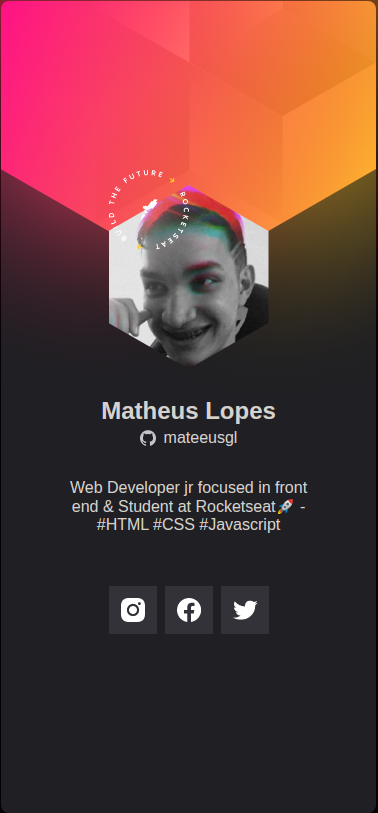
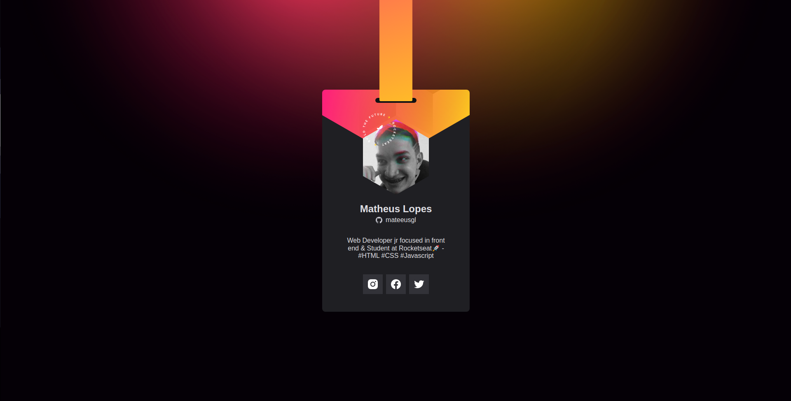

<h1 align="center">
    The virtual badge created through the NLW at Rocketseat for the event Dowhile 2021
</h1>

<h3>
  <a href="https://mateeusgl.github.io/crachanlw/">
    See project here
  </a>
</h3>

 

<h1>📱Mobile</h1>

     

<h1>🖥Desktop</h1>

     

<h1>🛠 Techs</h1>

&nbsp;
&nbsp;
&nbsp;

